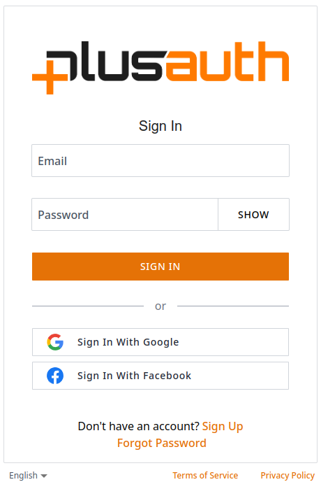

# Introduction

PlusAuth Widget a helper to be used for PlusAuth to display views.

You can customize theme, functionality and locales with a set of configuration.

This Storybook covers:

- widget initialization and runtime settings
- PlusAuth context shape and behavior
- page-level flows
- reusable UI components
- custom fields and custom templates

If you notice a gap or integration edge case, you are welcome to open an issue on the [project repository](https://github.com/PlusAuth/plusauth-widget/issues).

  

